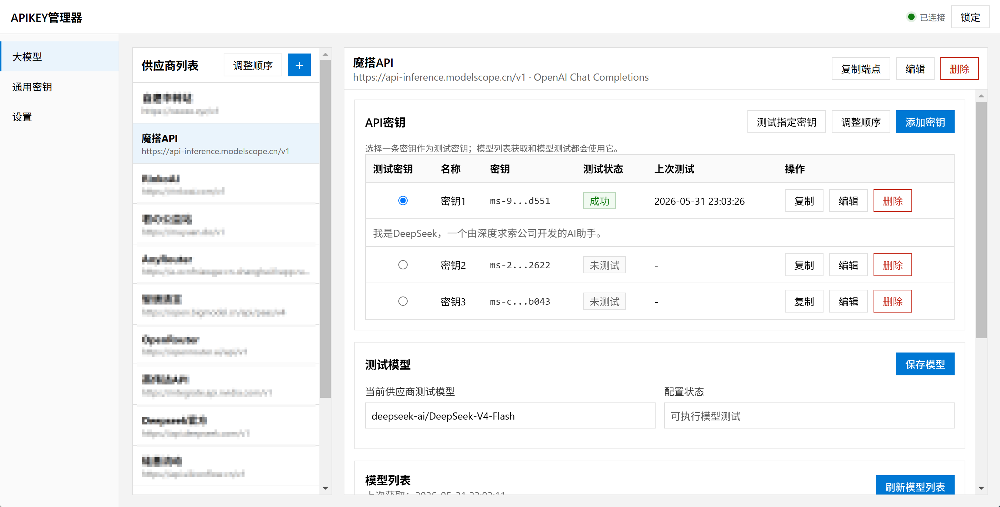
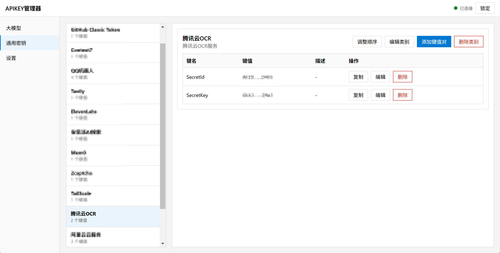

# APIKEY Manager

APIKEY Manager 是一个本地运行的 API Key 管理器。它主要用来保存、管理和测试大模型 API Key，也可以保存搜索服务、机器人、平台应用这类通用密钥和配置项。

数据只保存在你的电脑里，并使用 SQLCipher 加密。应用不会上传你的密钥，也不会连接统计或分析服务。

## 功能

- 管理多个大模型供应商，支持记录 API 端点和官网地址。
- 支持 `OpenAI Chat Completions`、`OpenAI Response`、`Anthropic Messages` 三类接口格式。
- 每个供应商可以保存多个 API Key，并指定其中一个作为测试密钥。
- 每个供应商单独设置测试模型；测试 Prompt 在设置页统一管理。
- 刷新并缓存模型列表，支持模型 ID 复制和前端搜索。
- 通用密钥按类别管理，一个类别下可以保存多个键值对。
- 支持供应商、密钥、通用类别、通用键值对排序。
- 删除等危险操作使用应用内确认浮窗，不调用浏览器原生弹窗。
- 右上角显示后端连接状态，断开连接时会给出明确提示。
- 时间默认按 UTC+8 展示。

## 系统展示





## 快速开始

直接运行当前目录下已经构建好的程序：

```text
APIKEY-Manager.exe
```

启动后会在本机开启服务，并自动打开默认浏览器：

```text
http://127.0.0.1:5157
```

第一次打开时需要创建主密码。主密码不会明文保存，也无法找回；忘记主密码就无法打开原来的数据库。

## 基本用法

### 大模型密钥

1. 添加供应商，填写名称、API 端点、官网地址和接口格式。
2. 添加一个或多个 API Key。
3. 选择一个 API Key 作为测试密钥。
4. 填写该供应商的测试模型。
5. 刷新模型列表，或测试指定密钥。

模型列表会缓存在本地，可以直接搜索和复制模型 ID。

### 通用密钥

1. 先创建类别，比如 `Tavily`、`QQ机器人`、`支付平台`。
2. 在类别下添加键名、键值和描述。
3. 使用时点击复制即可。

## 数据保存位置

默认数据库文件为 `apikeys.db`：

- Windows：`%APPDATA%\APIKEY-Manager\apikeys.db`
- macOS：`~/Library/Application Support/APIKEY-Manager/apikeys.db`
- Linux：`~/.apikey-manager/apikeys.db`

高级用户也可以通过环境变量指定数据目录：

```powershell
$env:APIKEY_MANAGER_DATA_DIR="C:\path\to\data"
.\APIKEY-Manager.exe
```

## 高级用法：从源代码启动

如果你想改代码或自己调试，可以从源码启动：

```powershell
python -m venv .venv
.\.venv\Scripts\Activate.ps1
python -m pip install -r requirements.txt
python run.py
```

源码方式启动后同样会自动打开：

```text
http://127.0.0.1:5157
```

## 高级用法：重新打包 exe

项目提供了 PyInstaller 打包脚本，会使用根目录下的 `favicon.ico` 作为图标。

先安装 PyInstaller：

```powershell
python -m pip install pyinstaller
```

开始打包：

```powershell
python build_pyinstaller.py
```

打包完成后，`APIKEY-Manager.exe` 会移动到项目根目录，`dist/`、`build/`、`build-spec/` 等临时目录会自动删除。

如果想隐藏控制台窗口：

```powershell
python build_pyinstaller.py --windowed
```

注意：程序本质上仍是本地 Web 应用。启动 exe 后会在本机启动服务，并自动打开浏览器访问 `http://127.0.0.1:5157`。如果想看到彩色控制台说明和停止提示，不要使用 `--windowed`。

## 开发命令

```powershell
python run.py
python -m unittest discover -s tests
python build_pyinstaller.py
```

前端脚本语法检查：

```powershell
node --check app\static\app.js
```

## 依赖

- Flask
- requests
- SQLCipher Python 绑定：`sqlcipher3`

如果 `sqlcipher3` 安装失败，通常是当前平台缺少可用 wheel，或缺少 SQLCipher / C++ 编译环境。

## 安全提醒

- 主密码不会明文保存，忘记后无法恢复数据库内容。
- 数据库文件使用 SQLCipher 加密。
- API Key 只会在你主动测试密钥或刷新模型列表时发送到你配置的 API 地址。
- 复制到剪贴板的内容可能被其他应用读取，使用后可以手动清空剪贴板。
- 项目不自动备份数据库，重要数据请自行备份 `apikeys.db`。
